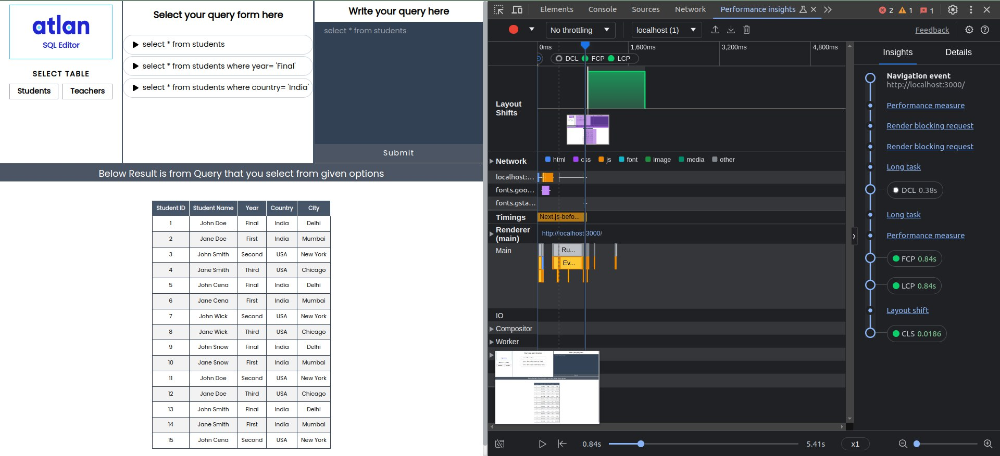
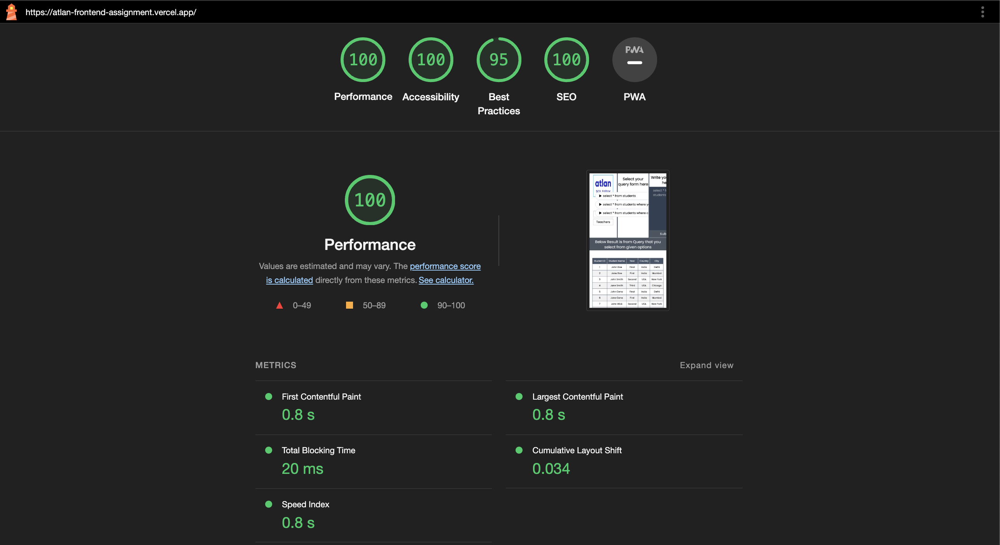
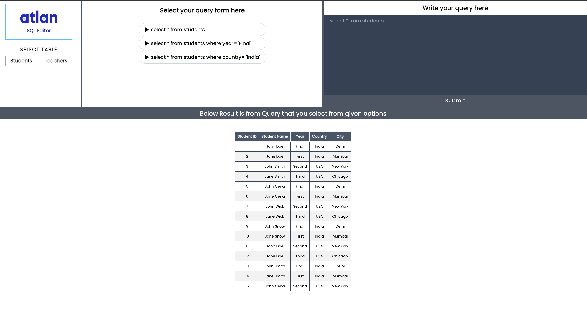
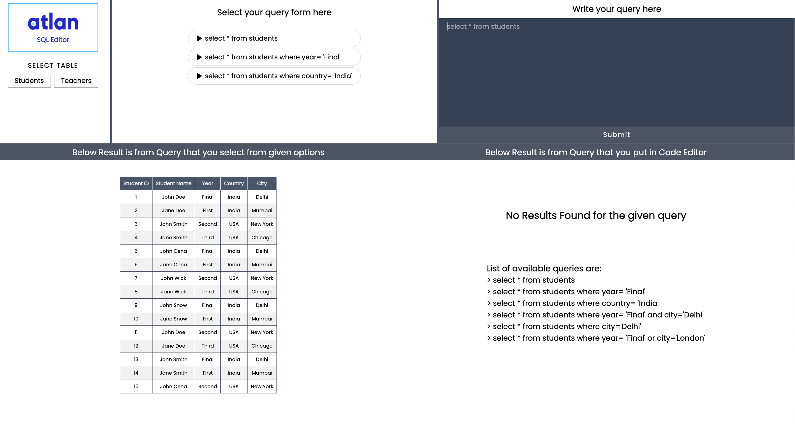
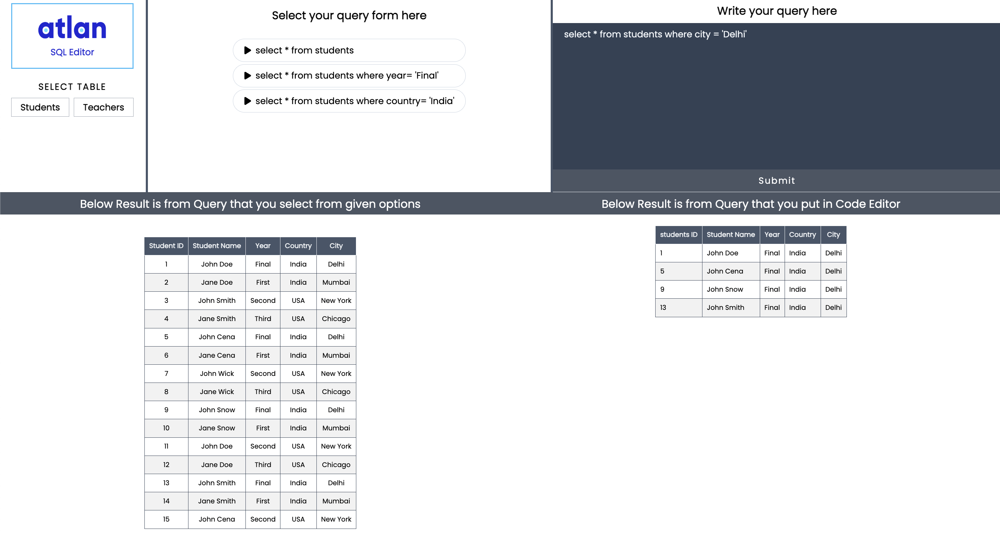

# Atlan Frontend Assesment

This Project is for atlan for evaluating front-end application given in their assignment i.e. built SQL editor specifically to fulfill the task given by Atlan.

## Technologies used

> 1.  NextJs
> 2.  Tailwind CSS

## Working

1. The top-left section consists of options to toggle between different Tables.

2. The next section contains options that directly put result of the given queries below in table format output.

3. Then on the right most section there is editor in which we can put coustom queries. The result of coustom queries are display at the bottom.
   <br/>List of all queries that can run in editor are:

```bash
    a. select * from customers
    b. select * from students where year = 'Final'
    c. select * from students where country = 'India'
    d. select * from students where year = 'Final' and city = 'Delhi'
    e. select * from students where city = 'Delhi'
    f. select * from students where year = 'Final' or city = 'London'
```

## Performance



<br>

## Optimization

> I Use only the core features of NextJs & Tailwind CSS.<br>
> I do not use any Third party Libraries which slow down page loading time as well as performance.

## Preview


<br>
<hr>
<br>



<br>
<hr>
<br>



